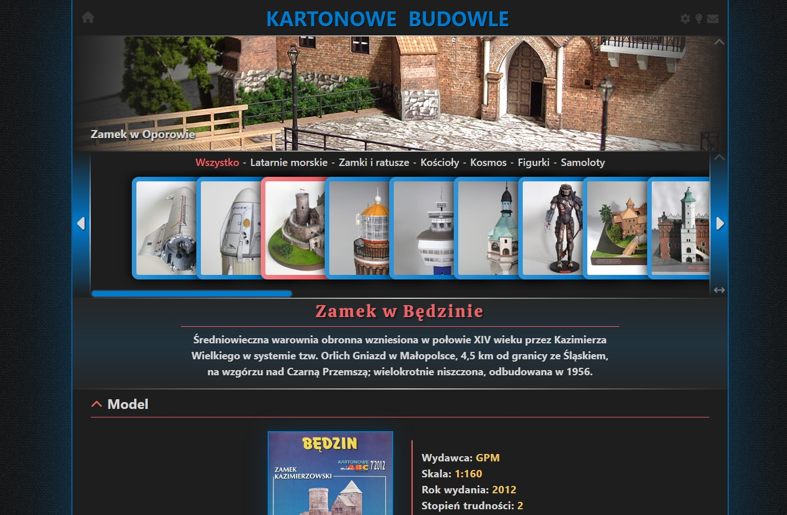

# Kartonowe budowle 
Jest to strona o sklejonych przeze mnie modelach kartonowych. Można tu obejrzeć galerie gotowych modeli, zdjęcia nocne z oświetleniem i również przy niektórych modelach zdjęcia z budowy.
Strona zrobiona jest z wykorzystaniem biblioteki REACT i frameworka Tailwind CSS.
Do przełączania między podstronami użyłem React Router.

Link do strony: https://kartonowebudowle.pl

