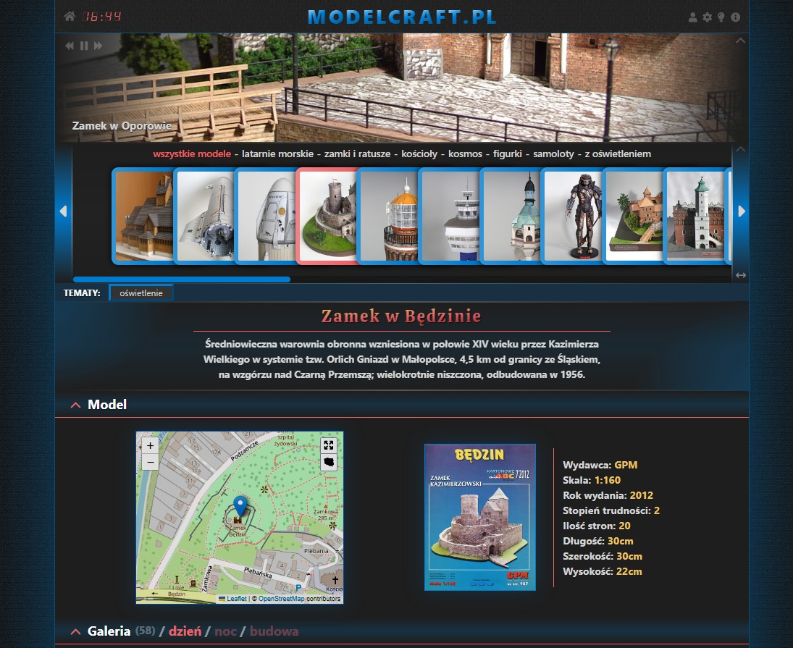

# Kartonowe budowle 
### Strona ze zdjęciami sklejonych przeze mnie modeli kartonowych.
Strona zrobiona jest z wykorzystaniem biblioteki REACT i frameworka Tailwind CSS.
Do przełączania między podstronami użyłem React Router.

Link do strony: https://kartonowebudowle.pl

